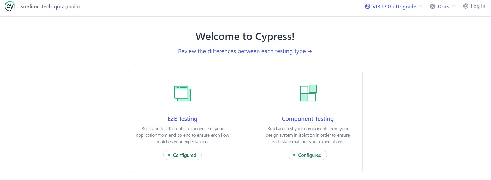
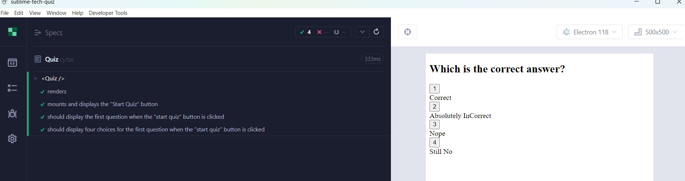
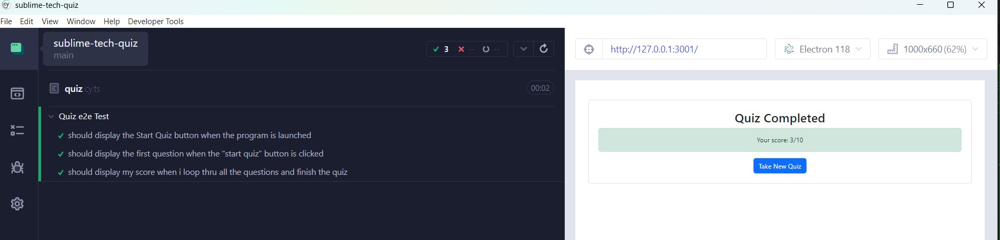

# sublime-tech-quiz
   

   ## Description

   This sublime tech quiz application demonstrates the power of comprehensive testing using cypress. I used cypress for both component and end to end automated testing building out few test cases.

   ## Table of Contents

   - [Installation](#installation)
   - [Technologies](#Technologies)
   - [Usage](#usage)
   - [Screenshots](#screenshots)
   - [Walkthru-Video](#walkthru-video)
   - [Challenges](#challenges)
   - [Tests](#tests)
   - [Future Implementation](#Future-Implementation)
   - [Contributing](#Contributing)
   - [Questions](#questions)
   - [License](#license)

   ## Installation
   The installation steps are simple - do a npm i, npm run build, npm run seed after successfully downloading the application. The database is hosted in the local MongoDB using react.

   ## Technologies
   MERN Stack with React front end, MongoDB database, Cypress, TypeScript, Javascript,npm,Node.js/Express.js server and API's.

   ## Usage
   Please do a npm i, npm run build, npm run seed after successfully downloading the application. The application can be launched using the npm script command and cypress could be run in parallel for testing e2e via electron.Please refer to the walkthru video demonstrating the functionality along with the execution of cypress test cases for both component and end to end testing.
   
   ## Screenshots

   **Cypress - Launch**

   
     
   **Cypress - Component Testing**

   

   **Cypress - End to End Testing**

   

   ## Walkthru-Video
   Please watch the below video explaining how to start the application and execute the cypress component and e2e testing
   https://drive.google.com/file/d/14hCYd8FFkD_5_hAxnQHrlwUoQRXwO2yV/view?usp=drive_link

   ## Challenges
   During the project, writing the test cases using cy was challenging at the beginning.However at the end of the project, I got a pretty good handle on the test cases using Cypress

   ## Tests
   Ensure that both the component and e2e testing passes

   ## Future Implementation
   Add additional cypress tests for both component and e2e

   ## Contributing
   Please review the future ideas options and try to contribute or if you find any issues during your testing, please contact me to report issues

   ## Questions
   Please check my GitHub Profile (https://github.com/https://github.com/Mahesh-GH24)  
   Please contact me at MaheshGunasekaran24@gmail.com

   ## License
   Apache License v2.0